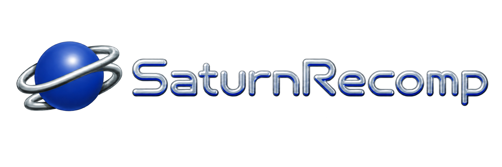

<p align="center">
  
</p>

# SaturnRecomp

SaturnRecomp is an experimental, clean-room Sega Saturn runtime and static-recompilation research toolkit. It contains a Saturn disc/configuration CLI, an SH-2 execution core, and a Windows SDL2 runner that boots a user-supplied game through a user-supplied Saturn BIOS.

The current playable path executes SH-2 code through the interpreter and its optimized fast path. The decoder and module-analysis foundation for ahead-of-time recompilation are present, but a complete public AOT emitter is not. The project name describes the destination; this README describes the current implementation without pretending it is finished.

## No games or firmware are included

This repository intentionally contains no BIOS ROM, game image, extracted executable, generated game code, save data, audio track, or game screenshot. You must dump the BIOS and game disc from hardware/media you own and keep those files local. Do not open an issue asking where to download copyrighted files.

SaturnRecomp is not affiliated with or endorsed by Sega. Sega Saturn and game names are trademarks of their respective owners.

## What works today

- Authentic BIOS reset and IPL/CD boot path, including the boot animation and automatic game boot.
- Dual SH-2 scheduling, cache behavior, interrupts, FRT, SCU DMA, and SCU DSP execution.
- VDP1 command-list rasterization with clipping, mesh, color calculation, and double buffering.
- VDP2 cell/bitmap backgrounds, rotation parameters, windows, special priority, color calculation, and VDP1/VDP2 composition.
- MC68000 sound CPU, SCSP slots/DSP, CD-DA streaming, SMPC input, and persistent console settings.
- CUE/BIN and ISO disc access, ISO9660 inspection/extraction, IP.BIN parsing, and per-game TOML declarations.
- SDL2 window, keyboard/controller input, audio pacing, frame stepping, and diagnostic views.

This remains experimental. Compatibility is title-dependent, performance is below mature emulators such as Ymir, and SCSP DSP/audio behavior is not yet bit-perfect. See [Compatibility and limitations](docs/COMPATIBILITY.md).

## Quick start

Requirements: 64-bit Windows, PowerShell 5.1 or newer, MSYS2 MinGW-w64 GCC, and the MSYS2 SDL2 development package.

```powershell
# In an MSYS2 MINGW64 shell:
pacman -S --needed mingw-w64-x86_64-gcc mingw-w64-x86_64-SDL2

# In PowerShell, from the repository root:
.\build.ps1
Copy-Item games\_template games\mygame -Recurse
```

Place your own dumps outside version control, edit `games\mygame\game.toml`, validate it, then launch:

```powershell
.\recompiler\saturnrecomp.exe inspect .\discs\mygame.cue
.\recompiler\saturnrecomp.exe modules .\games\mygame\game.toml
.\runner\saturnwin.exe .\games\mygame\game.toml
```

The full, field-by-field setup procedure is in [Setting up a game](docs/GAME_SETUP.md).
For a tested title-specific example, see [Sonic 3D Blast setup](docs/SONIC_3D_BLAST.md).

## Repository map

```text
external/sh2-recomp-core/   SH-2 ISA definitions and table-driven decoder
recompiler/                 Disc, ISO9660, IP.BIN, config, and inspection CLI
runner/                     Saturn hardware runtime and SDL/headless frontends
tests/                      CPU, scheduler, video, sound, and decoder checks
tools/                      Generic inspection and release-audit utilities
games/_template/            The only game directory shipped by this repository
docs/                       Setup, architecture, compatibility, and legal policy
assets/                     Project-authored SaturnRecomp logo
```

## Command-line tools

```text
saturnrecomp inspect <disc.cue|bin|iso>
saturnrecomp extract <disc> </ISO/PATH> <outfile>
saturnrecomp disasm  <rawfile> <base-address> [instruction-count]
saturnrecomp modules <games/<name>/game.toml>

saturnwin  <games/<name>/game.toml> [nobios]
saturnboot <games/<name>/game.toml> [max-instructions] [nobios]
```

`nobios` selects incomplete HLE firmware stubs and is intended for diagnostics. Normal play should configure a valid BIOS dump so the real IPL establishes the machine and auto-boots the disc.

## Build and test

```powershell
.\build.ps1
.\tests\run_all.ps1
.\tools\audit_release.ps1
```

Set `SATURN_MINGW_BIN` if MinGW is not installed at `C:\msys64\mingw64\bin`. Decoder-oracle comparison additionally needs Python with `capstone` installed; the hardware/runtime tests do not.

The renderer regressions include per-character VDP2 foreground priority, VDP1/user-versus-system clipping, and VDP1/VDP2 tie behavior. The scheduler suite also asserts that a frontend frame ends at V-Blank-IN, matching the frame boundary used by Ymir.

## Documentation

- [Setting up a game](docs/GAME_SETUP.md)
- [Sonic 3D Blast setup](docs/SONIC_3D_BLAST.md)
- [Architecture](docs/ARCHITECTURE.md)
- [Compatibility and limitations](docs/COMPATIBILITY.md)
- [Testing and diagnostics](docs/TESTING.md)
- [Firmware, game data, and release policy](docs/LEGAL.md)
- [Saturn hardware notes](docs/HARDWARE.md)
