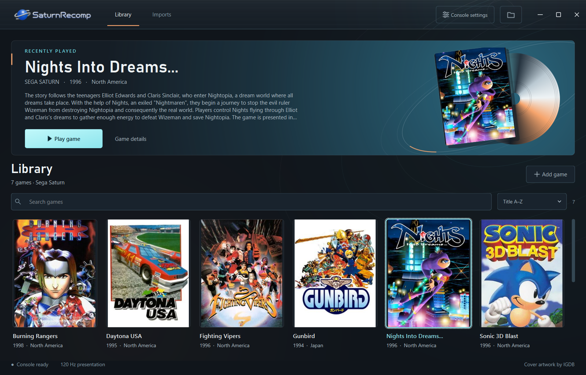
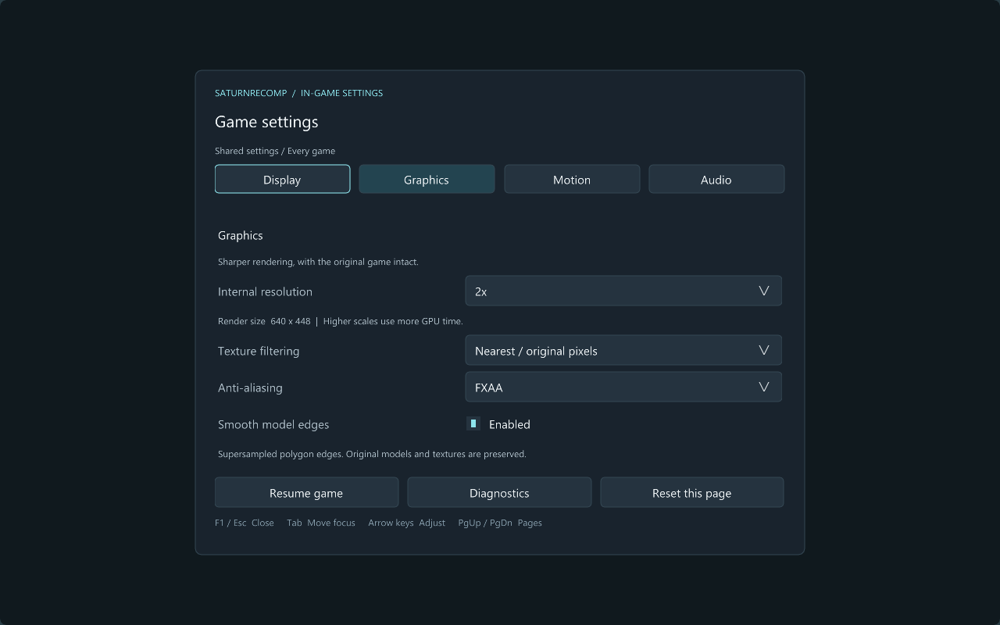
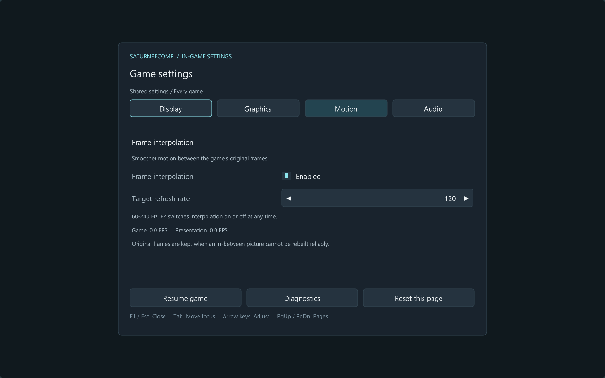

# SaturnRecomp desktop library

SaturnRecomp's launcher is a native desktop application built with PySide6 and
Qt Widgets. The game library, search, import queue, settings, and file pickers
run directly in the application. No browser or WebView2 installation is needed.

## Screenshots



[Compact window](images/launcher-compact.png) · [Keyboard and controller controls](images/launcher-controls.png)

Cover art shown belongs to its respective owners. These interface previews do
not establish game compatibility; game files and assets are supplied locally.

## Build and open the launcher

The launcher currently targets 64-bit Windows. To build it, install Python 3.10
or newer and MSYS2 with its MinGW64 toolchain. The Python requirements install
PySide6, PyInstaller, and Pillow. A Vulkan-capable graphics driver is needed for
the default renderer and 120 Hz presentation.

In the **MSYS2 MINGW64** terminal, install the build dependencies:

```sh
pacman -S --needed mingw-w64-x86_64-gcc mingw-w64-x86_64-SDL2 mingw-w64-x86_64-mpg123 mingw-w64-x86_64-vulkan-headers mingw-w64-x86_64-vulkan-loader mingw-w64-x86_64-shaderc
```

Then, in **PowerShell**, from the repository root:

```powershell
python -m pip install -r launcher/requirements.txt
powershell -NoProfile -ExecutionPolicy Bypass -File tools/build_launcher.ps1
.\dist\SaturnRecomp\SaturnRecomp.exe
```

The build compiles the shared runtime, Vulkan shaders, disc importer and game
entry point, then packages `launcher/app.py` and Qt into the desktop application.
It includes `libmpg123-0.dll` beside the importer and synchronizes it beside
the library's shared runtime, so MP3 CD-audio tracks work without MSYS2 on the
player's computer.
If MinGW is installed elsewhere, set `$env:SATURN_MINGW_BIN` to its
`mingw64/bin` directory first.
Use `-Python <path-to-python.exe>` with the build script if the packaging
dependencies were installed into a different Python environment.

If you already have a built package, open `SaturnRecomp.exe` inside it;
Python and the build toolchain are only needed to build from source.
Keep the entire packaged `SaturnRecomp` directory together, including
`_internal`; the executable alone is insufficient. Place it in a writable
folder because your library is stored beside the application.

## Play NiGHTS or another Saturn game

1. Open **Console settings**, choose **Choose BIOS**, and select your own
   512 KB Saturn BIOS dump. Use a BIOS appropriate for your disc's region.
2. Choose **Add game** and select your disc. For NiGHTS in CUE/BIN format,
   select the **.cue** file and keep every referenced track file beside it.
   You can select several discs in the file picker.
3. Wait for the import to finish. Progress and failures appear under **Imports**
   in the top navigation. Box art is optional and does not block playing.
4. Select the NiGHTS cover in **Library**, then choose **Play game** in
   the selected-game area. A separate game window opens and boots through
   the Saturn BIOS.
5. Click the game window to focus it. Press **Enter** at the title screen,
   use the arrow keys to navigate, and **Z** for Saturn A/confirmation.
   If the BIOS requests initial clock or language setup, complete that first.

The same steps apply to other supported Saturn discs; no hand-written
`game.toml` is required. ISO, CUE/BIN, and IMG inputs are accepted; CHD is
not supported. A plain data ISO does not include separate CD audio tracks.
For mixed-mode games, use a complete CUE with its tracks to retain music.
Importing an ISO cannot recreate missing audio.
CUE sheets containing MP3 audio tracks are supported on Windows. Keep the
MP3 files beside the CUE; selecting the data ISO by itself omits those tracks.

Keep the original disc files accessible after import. The runtime still reads
them during play; the extracted assets are not a replacement for the disc.

## Find and manage games

Use **Library** in the top navigation to browse your collection. Search by title
and choose a sort order above the covers. Selecting a cover updates the
selected-game area; **Play game** launches that selection, and **Game details**
opens its information and files. Double-clicking a cover also opens its details.

Press **Ctrl+K** to focus search and **Ctrl+O** to add discs. With the game grid
focused, use the arrow keys to select a game and **Enter** to open its details.

**Add game** opens the native Windows file picker and accepts multiple CUE,
ISO, BIN, or IMG files. For a multi-track disc, select its CUE once instead of
importing the individual tracks. Follow preparation in **Imports** and return
to **Library** when it finishes.

Open **Console settings** for the BIOS picker, frame interpolation option,
and keyboard control reference.

The top navigation also serves as the window's title bar. Drag its logo or
empty space to move the window, double-click to maximize or restore, and use
the controls at the right to minimize, maximize, or close. Window edges remain
resizable; maximizing respects the Windows taskbar. Hovering the maximize
control exposes Snap layouts on supported Windows versions.

## Controls and presentation

| Saturn control | Keyboard | Xbox-style controller |
| --- | --- | --- |
| Direction | Arrow keys or W/A/S/D | D-pad or left stick |
| Start | Enter | Start |
| A / B / C | Z / X / C | A / B / RB |
| X / Y / Z | R / T / Y | X / Y / LB |
| L / R | Q / E | LT / RT |

Connect an SDL-compatible controller to use the controller mapping.
**F1** opens the shared in-game settings panel. **Esc** closes the panel when
it is open; otherwise it closes the game. **Space** pauses/resumes, and **F** advances one
field while paused. The launcher remains available for another game.

The F1 panel has four pages:

| Page | Settings |
| --- | --- |
| Display | Window resolution and fullscreen |
| Graphics | 1x–4x internal resolution, nearest or bilinear texture filtering, FXAA, and supersampled model edges |
| Motion | Frame interpolation on/off and a target refresh rate from 60 to 240 Hz |
| Audio | Master volume and mute |

<details>
<summary>Preview the in-game graphics and interpolation pages</summary>




These are actual Vulkan-rendered UI previews over a synthetic background;
their zero FPS counters are placeholders, not gameplay measurements.

</details>

Changes apply during play and are saved in the library's `settings.ini` for
every game. Direct per-game executables share this file too. A standalone
runtime uses `settings.ini` beside its executable unless `SATURN_SETTINGS_FILE`
selects a different file. Use the mouse, or **Tab** to move focus and arrow keys
to adjust controls; **Page Up/Page Down** changes pages. **Diagnostics** opens
the existing renderer inspection tools. Slider adjustments are saved after a
brief idle interval; closing the panel or game saves the latest values.

Internal resolution rerasterizes supported geometry at a higher resolution.
**Smooth model edges** uses additional supersampling; it preserves the original
model shapes. Texture filtering smooths RGB samples while preserving indexed
palette and priority codes. These options increase GPU work and cannot add
detail absent from the game's source textures. Scenes that cannot be replayed
safely retain their native sprite framebuffer.

The frame interpolation option in Console settings remains available for the next
launch. **F2** toggles interpolation during play, using the target rate selected
in F1, and saves the choice for future launches.
Interpolation is experimental and leaves the game's logic and audio clocks
unchanged. Connected geometry with uncertain correspondence stays at its native
position for that picture; verified geometry can still interpolate. This avoids
stretching part of a model or opening a shared edge when a face cannot be matched.
Inserted frames retain the displayed picture's texture, palette and lighting
data, preventing future draw data from recoloring its walls or environment.
Leave interpolation off initially if diagnosing image or pacing problems.

## Library, updates and troubleshooting

The importer reads the Saturn header and ISO9660 directory, extracts files,
and creates a manifest and executable in each game's folder:

```text
library/
  settings.json, settings.ini
  bios/                         Selected user BIOS copies
  runtime/                      Shared runtime and shaders
  games/<title-product>/
    <title-product>.exe          Launch this title directly
    game.toml, game.json
    manifest.xml                Disc identity, boot file, files and tracks
    assets/                     Extracted ISO9660 files
    cover.jpg                   Cached IGDB box art, when available
    console.bin                 Console settings (created during play)
    runtime.log                 Last launch output
```

**Open folder** in a game's details opens its files. The folder button at the
top right, **Open library folder**, opens the whole library. Per-game executables
rely on the adjacent shared library runtime and should stay in their game directories.

After pulling an update, close the launcher and game windows and rerun the
build command above. Packaging preserves the existing `library` directory.
Open the updated launcher once to synchronize its shared runtime and shaders
before starting games, including directly through their game executables.
This also restores the bundled MP3 decoder to `library/runtime`.

A failed import is never marked ready. Its log and partial files remain in
`library/.staging/<job>/` for diagnosis. For a launch failure, check
`runtime.log` in the game's folder, confirm the original disc and all CUE
tracks still exist, and confirm your selected BIOS is appropriate.
For missing music, first check that you imported the CUE instead of its data
track; for distorted output or audio, include the last stage reached when
reporting the problem. Compatibility testing remains incomplete.

Optional box art uses IGDB through existing local Odyssey credentials in
`%APPDATA%/Odyssey/config.json`, with `~/Odyssey/odyssey/customize.py` as a
fallback. Without those credentials, games still import and play with placeholder
covers. Credentials and game artwork are not bundled with the application;
the documentation screenshots show example covers.

## Execution status

The current runtime primarily interprets SH-2 code. These per-game executables
launch the shared runtime; extraction and XML generation are preparation for
recompilation, not a complete ahead-of-time compiler. Extracted assets are
available for tooling, while the game still reads the original disc. A full
AOT emitter, dynamic module handling, and execution coverage validation remain
required before these can be described as statically recompiled games.

Import completion establishes that the files were prepared. It does not
establish gameplay compatibility. Game details show verification separately.

The launcher uses the same experimental runtime for every game. Compatibility,
rendering, audio, and performance vary by title; importing a game is not a
compatibility test. Targeted comparisons have fixed specific rendering and
audio defects; broad compatibility and full-game testing remain pending. See
[Compatibility and limitations](COMPATIBILITY.md) for the project's current scope.
